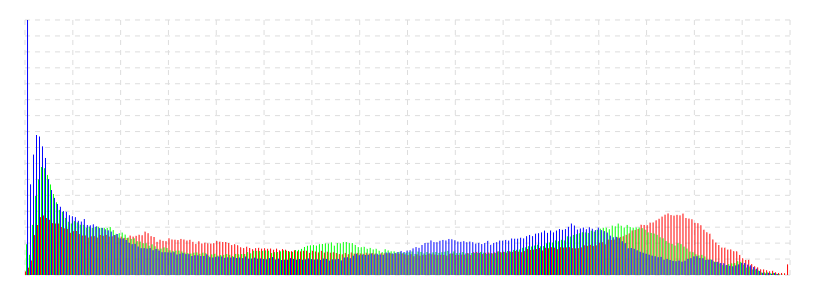
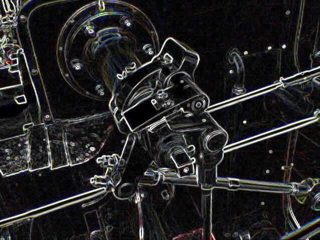
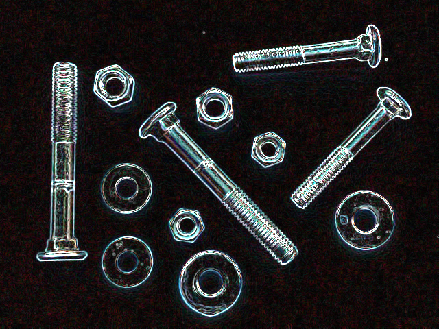
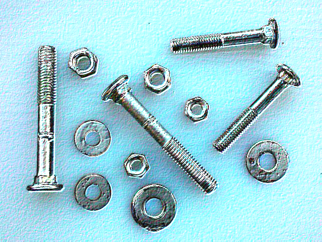
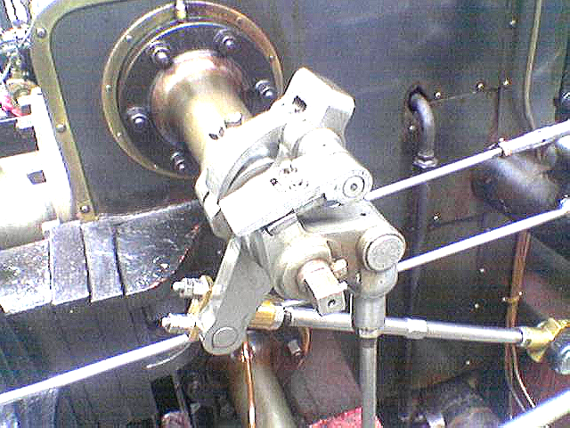

# ColorImageData

A classe [ColorImageData](../../source/ColorImageData.mjs) realiza operações com os três canais de cores (Red, Green, Blue).

> [!WARNING]
> Essa classe é uma extenção de [ImageData](https://developer.mozilla.org/en-US/docs/Web/API/ImageData).

## Índice

**Métodos básicos**
- [clone](#clone)
- [crop](#crop)
- [resize](#resize)
- [fill](#fill)
- [getLine](#getLine)
- [setLine](#setLine)

**Pre-processamento**
- [brightness](#brightness)
- [contrast](#contrast)
- [grayScale](#grayScale)
- [negative](#negative)
- [threshold](#threshold)
- [thresholdMean](#thresholdMean)

**Mesclagem de imagens**
- [blend](#blend)
- [blendMax](#blendMax)
- [blendMin](#blendMin)

**Detecção de bordas**
- [conv](#conv)

**Equalização**
- [clahe](#clahe)
- [getHistogram](#getHistogram)

**Morfologia**
- [erode](#erode)
- [dilate](#dilate)
- [open](#open)
- [close](#close)

## Métodos

### (static) Extends

Altera o [prototype](https://developer.mozilla.org/pt-BR/docs/Web/JavaScript/Reference/Global_Objects/Object/proto) de um [ImageData](https://developer.mozilla.org/en-US/docs/Web/API/ImageData) como [ColorImageData](../../source/ColorImageData.mjs).

> [!Note]
> Por padrão, ao utilizar o método `pixel.load()`, o [ImageData](https://developer.mozilla.org/en-US/docs/Web/API/ImageData) resultante já terá sido realizado o `ColorImageData.Extends()`.

| Argumento | Tipo | Descrição |
|-----------|------|-----------|
| target    | [ImageData](https://developer.mozilla.org/en-US/docs/Web/API/ImageData) | ImageData original |

#### Exemplo

```javascript

pixel.ColorImageData.Extends( imagedata );

```

### blend

Realiza a mesclagem de dois [ColorImageData]().

| Argumento | Tipo | Descrição |
|-----------|------|-----------|
| input     | [ColorImageData]() | Segunda Imagem para a mesclagem |
| as        | [Number](https://developer.mozilla.org/en-US/docs/Web/JavaScript/Reference/Global_Objects/Number) | Brilho da primeira imagem (instância referenciada). Valor entre `0.0 < x 1.0`. |
| bs        | [Number](https://developer.mozilla.org/en-US/docs/Web/JavaScript/Reference/Global_Objects/Number) | Brilho da segunda imagem (parametro `input`). Valor entre `0.0 < x 1.0`. |

#### Retorno

Uma nova [ColorImageData]() com a menor dimensão entre as duas imagens informadas.

#### Exemplo

Seja, `imageA` e `imageB` instâncias de [ColorImageData](). É gerado uma nova imagem (`imageC`) da mesclagem entre `imageA` e `imageB`.

```javascript

let imageC = imageA.blend( imageB, .5, .5 );

pixel.createContext( imageC, document.body );

```

### blendMin

Realiza a mesclagem dos menores valores entre dois [ColorImageData]().

| Argumento | Tipo | Descrição |
|-----------|------|-----------|
| input     | [ColorImageData]() | Segunda Imagem para a mesclagem |

#### Retorno

Uma nova [ColorImageData]() com a menor dimensão entre as duas imagens informadas.

### blendMax

Realiza a mesclagem dos maiores valores entre dois [ColorImageData]().

| Argumento | Tipo | Descrição |
|-----------|------|-----------|
| input     | [ColorImageData]() | Segunda Imagem para a mesclagem |

#### Retorno

Uma nova [ColorImageData]() com a menor dimensão entre as duas imagens informadas.

### brightness

Ajuste global da intensidade dos pixels, é realizado multiplicando os valores de intensidade.

| Argumento | Tipo | Descrição |
|-----------|------|-----------|
| sr        | [Number](https://developer.mozilla.org/en-US/docs/Web/JavaScript/Reference/Global_Objects/Number) | Valor que irá multiplicar o canal Vermelho. Por padrão é `1.0`. |
| sg        | [Number](https://developer.mozilla.org/en-US/docs/Web/JavaScript/Reference/Global_Objects/Number) | Valor que irá multiplicar o canal Verde. Por padrão é `sr`. |
| sb        | [Number](https://developer.mozilla.org/en-US/docs/Web/JavaScript/Reference/Global_Objects/Number) | Valor que irá multiplicar o canal Azul.Por padrão é `sg`. |

#### Retorno

O retorno é a própria instâcia ([ColorImageData]()), ou seja, os valores da *instância são alterados*.
Desse modo é possivel realizar o encadeamento de métodos.

### clahe

CLAHE (Contrast Limited Adaptive Histogram Equalization) é uma técnica de processamento de imagem usada para melhorar o contraste local em uma imagem.
Ela é uma extensão do método de equalização de histograma, que redistribui os valores de intensidade dos pixels em uma imagem para melhorar o contraste global. 

```javascript

pixel.load( "path/to/image", function( imagedata ) {
	
	imagedata.clahe();
	
	pixel.createContext( imagedata, document.body );
	
});

```

| Antes  | Depois    |
|:-:|:-:|
|  |  |
|  |  |

### clone

Cria uma nova instacia com os mesmos valores.

#### Exemplo

```javascript

pixel.load( "path/to/image", function( imagedata ) {
	
	let original = imagedata.clone();
	
});

```

### close

O [Fechamento](https://en.wikipedia.org/wiki/Closing_(morphology)) é uma peração de morfologia, da qual realiza a [dilatação](#dilate) seguida de [erosão](#erode).

Pode ser utilizada para preencher pequenos buracos e conectar regiões próximas, **fechando** espaços dentro de objetos e suavizando contornos.

| Argumento | Tipo | Descrição |
|-----------|------|-----------|
| matrix    | [Matrix](Matrix.md) | Uma matriz que define a estrutura da operação (Quadrado, Cruz, Círculo) |

#### Retorno

O retorno é a própria instâcia ([ColorImageData]()), ou seja, os valores da *instância são alterados*.
Desse modo é possivel realizar o encadeamento de métodos.

### contrast

Realiza o contraste da [ColorImageData]().

| Argumento | Tipo | Descrição |
|-----------|------|-----------|
| value     | [Number](https://developer.mozilla.org/en-US/docs/Web/JavaScript/Reference/Global_Objects/Number) | Valor que ajusta o contraste da imagem |

#### Retorno

O retorno é a própria instâcia ([ColorImageData]()), ou seja, os valores da *instância são alterados*.
Desse modo é possivel realizar o encadeamento de métodos.

### conv

O metodo `conv` realiza a [convolução](https://en.wikipedia.org/wiki/Kernel_\(image_processing\)) em uma imagem.

| Argumento | Tipo | Descrição |
|-----------|------|-----------|
| matrix    | Matrix | A matriz de convolução (tambem chamadas de Kernel ou Mask). Dependendo de seus valores poderá resultados com diferentes efeitos. |

#### Retorno

O retorno é a própria instâcia ([ColorImageData]()), ou seja, os valores da *instância são alterados*.
Desse modo é possivel realizar o encadeamento de métodos.

#### Exemplos

|  |  |  |
|:-:|:-:|:-:|
| Prewitt | Sobel | Laplace |

|  |  |  |
|:-:|:-:|:-:|
| Emboss | Sharpen | GaussianBlur |

```javascript

pixel.load( "path/to/image", function( imagedata ) {
	
	imagedata.conv( pixel.Matrix.Sobel() );
	
	pixel.createContext( imagedata, document.body );
	
});

```

### crop

Realiza o recorte da [ColorImageData]().

| Argumento | Tipo | Descrição |
|-----------|------|-----------|
| rx        | [Number](https://developer.mozilla.org/en-US/docs/Web/JavaScript/Reference/Global_Objects/Number) | Posição `X` do inicio do recorte |
| ry        | [Number](https://developer.mozilla.org/en-US/docs/Web/JavaScript/Reference/Global_Objects/Number) | Posição `Y` do inicio do recorte |
| rw        | [Number](https://developer.mozilla.org/en-US/docs/Web/JavaScript/Reference/Global_Objects/Number) | Largura do recorte |
| rh        | [Number](https://developer.mozilla.org/en-US/docs/Web/JavaScript/Reference/Global_Objects/Number) | Altura do recorte |

#### Retorno

O retorno é uma nova instâcia de ([ColorImageData]()) com as dimensões `rw`x`rh`.

#### Exemplo

Seja `imageA` uma instância de [ColorImageData]().

```javascript

let imageB = imageA.blend( 0, 0, 50, 50 );

pixel.createContext( imageB, document.body );

```

### dilate

A [dilatação](https://en.wikipedia.org/wiki/Dilation_(morphology)) é uma operação em morfologia, da qual expande regiões claras, tornando os objetos maiores.

| Argumento | Tipo | Descrição |
|-----------|------|-----------|
| matrix    | [Matrix](Matrix.md) | Uma matriz que define a estrutura da operação (Quadrado, Cruz, Círculo) |

#### Retorno

O retorno é a própria instâcia ([ColorImageData]()), ou seja, os valores da *instância são alterados*.
Desse modo é possivel realizar o encadeamento de métodos.

### erode

A [erosão](https://en.wikipedia.org/wiki/Erosion_(morphology)) é uma operação em morfologia, da qual reduz as regiões claras, tornando os objetos menores.

| Argumento | Tipo | Descrição |
|-----------|------|-----------|
| matrix    | [Matrix](Matrix.md) | Uma matriz que define a estrutura da operação (Quadrado, Cruz, Círculo) |

#### Retorno

O retorno é a própria instâcia ([ColorImageData]()), ou seja, os valores da *instância são alterados*.
Desse modo é possivel realizar o encadeamento de métodos.

### fill

Preenche toda a imgem com uma única cor.

| Argumento | Tipo | Descrição |
|-----------|------|-----------|
| bytes     | [Number](https://developer.mozilla.org/en-US/docs/Web/JavaScript/Reference/Global_Objects/Number) | Cor em hexadecimal da linha a ser desenha (32 bits). **Recomendação:** Utilizar o método `getBytes()` de uma instância de [Color](Color.md#getBytes). |

#### Retorno

O retorno é a própria instâcia ([ColorImageData]()), ou seja, os valores da *instância são alterados*.
Desse modo é possivel realizar o encadeamento de métodos.

#### Exemplo

Seja `source` uma instância de [ColorImageData](), a imagem será preenchida por vermelho.

```javascript

source.fill( pixel.Color.Hex( 0xff0000 ) );

```

### getHistogram

Os argumentos são opcional, caso n

| Argumento | Tipo | Descrição |
|-----------|------|-----------|
| wx        | [Number](https://developer.mozilla.org/en-US/docs/Web/JavaScript/Reference/Global_Objects/Number) | Posição `X` do inicio do recorte.\nPadrão é `0` |
| wy        | [Number](https://developer.mozilla.org/en-US/docs/Web/JavaScript/Reference/Global_Objects/Number) | Posição `Y` do inicio do recorte.\nPadrão é `0` |
| ww        | [Number](https://developer.mozilla.org/en-US/docs/Web/JavaScript/Reference/Global_Objects/Number) | Largura do recorte.\nPadrão é a *largura* da imagem. |
| wh        | [Number](https://developer.mozilla.org/en-US/docs/Web/JavaScript/Reference/Global_Objects/Number) | Altura do recorte.\nPadrão é *altura* da imagem. |

#### Retorno

O retorno é um [Array](https://developer.mozilla.org/en-US/docs/Web/JavaScript/Reference/Global_Objects/Array) com 3 itens, um para cada canal da imagem (RGB).
Cada item é um [Object](https://developer.mozilla.org/en-US/docs/Web/JavaScript/Reference/Global_Objects/Object), em que `key` é a intensidade do pixel e `value` é a contagem (ocorrência) dessa intensidade.
**Obs**. Pode ser que algumas intensidades não existam no canal, e nesse caso não são contabilizados.

#### Exemplo

Seja `source` uma instância de [ColorImageData]().

```javascript

let histogramData = source.getHistogram();

let redChannel = histogramData[0];
let greenChannel = histogramData[1];
let blueChannel = histogramData[2];

```

### getLine

Realiza a leitura dos pixeis do ponto `ax,ay` ao `bx,by`.

| Argumento | Tipo | Descrição |
|-----------|------|-----------|
| ax        | [Number](https://developer.mozilla.org/en-US/docs/Web/JavaScript/Reference/Global_Objects/Number) | Posição `X` do inicio da linha |
| ay        | [Number](https://developer.mozilla.org/en-US/docs/Web/JavaScript/Reference/Global_Objects/Number) | Posição `Y` do inicio da linha |
| bx        | [Number](https://developer.mozilla.org/en-US/docs/Web/JavaScript/Reference/Global_Objects/Number) | Posição `X` do final da linha |
| by        | [Number](https://developer.mozilla.org/en-US/docs/Web/JavaScript/Reference/Global_Objects/Number) | Posição `Y` do final da linha |

#### Retorno

O retorno é um [Uint32Array](https://developer.mozilla.org/en-US/docs/Web/JavaScript/Reference/Global_Objects/Uint32Array), em que cada item é a cor de um pixel (32 bits).

### grayScale

Altera a imagem para tons de cinza. Note que a imagem ainda possui os 4 canais (RGBA), porém os canais RGB possuem o mesmo valor.

#### Retorno

O retorno é a própria instâcia ([ColorImageData]()), ou seja, os valores da *instância são alterados*.
Desse modo é possivel realizar o encadeamento de métodos.

### negative

Inverte os valores de RGB.

#### Retorno

O retorno é a própria instâcia ([ColorImageData]()), ou seja, os valores da *instância são alterados*.
Desse modo é possivel realizar o encadeamento de métodos.

### open

A [abertura](https://en.wikipedia.org/wiki/Opening_(morphology)) é uma peração de morfologia, da qual realiza a [erosão](#erode) seguida de [dilatação](#dilate).

Pode ser utilizada usada para remover ruídos e suavizar contornos sem afetar significativamente o tamanho dos objetos principais.

| Argumento | Tipo | Descrição |
|-----------|------|-----------|
| matrix    | [Matrix](Matrix.md) | Uma matriz que define a estrutura da operação (Quadrado, Cruz, Círculo) |

#### Retorno

O retorno é a própria instâcia ([ColorImageData]()), ou seja, os valores da *instância são alterados*.
Desse modo é possivel realizar o encadeamento de métodos.

### resize

Redimensiona a [ColorImageData]().

| Argumento | Tipo | Descrição |
|-----------|------|-----------|
| sx        | [Number](https://developer.mozilla.org/en-US/docs/Web/JavaScript/Reference/Global_Objects/Number) | Valor que ira multiplicar no eixo `X`. Padrão é `1`. |
| sy        | [Number](https://developer.mozilla.org/en-US/docs/Web/JavaScript/Reference/Global_Objects/Number) | Valor que ira multiplicar no eixo `Y`. Padrão é `1`. |

#### Retorno

O retorno é uma nova instâcia de ([ColorImageData]()) com as dimensões multiplicadas (`sx*width, sy*height`).

### setLine

Define o valor dos pixeis do ponto `ax,ay` ao `bx,by`. Note que o parâmetro `bytes` pode ser 
- [Number](https://developer.mozilla.org/en-US/docs/Web/JavaScript/Reference/Global_Objects/Number): A linha toda será preenchida com o mesmo valor; ou
- [Uint32Array](https://developer.mozilla.org/en-US/docs/Web/JavaScript/Reference/Global_Objects/Uint32Array): A linha será preenchida com os valores da sequência informada.

| Argumento | Tipo | Descrição |
|-----------|------|-----------|
| ax        | [Number](https://developer.mozilla.org/en-US/docs/Web/JavaScript/Reference/Global_Objects/Number) | Posição `X` do inicio da linha |
| ay        | [Number](https://developer.mozilla.org/en-US/docs/Web/JavaScript/Reference/Global_Objects/Number) | Posição `Y` do inicio da linha |
| bx        | [Number](https://developer.mozilla.org/en-US/docs/Web/JavaScript/Reference/Global_Objects/Number) | Posição `X` do final da linha |
| by        | [Number](https://developer.mozilla.org/en-US/docs/Web/JavaScript/Reference/Global_Objects/Number) | Posição `Y` do final da linha |
| bytes     | [Number](https://developer.mozilla.org/en-US/docs/Web/JavaScript/Reference/Global_Objects/Number) \| [Uint32Array](https://developer.mozilla.org/en-US/docs/Web/JavaScript/Reference/Global_Objects/Uint32Array) | Valores em que cada pixel que será preenchido na linha. **Recomendação:** Utilizar o método `getBytes()` de uma instância de [Color](Color.md#getBytes). |

#### Retorno

O retorno é a própria instâcia ([ColorImageData]()), ou seja, os valores da *instância são alterados*.
Desse modo é possivel realizar o encadeamento de métodos.

### threshold

Torna a imagem em preto e branco. Note que a imagem ainda possui os 4 canais (RGBA), porém os canais RGB possuem o mesmo valor.

| Argumento | Tipo | Descrição |
|-----------|------|-----------|
| value     | [Number](https://developer.mozilla.org/en-US/docs/Web/JavaScript/Reference/Global_Objects/Number) | Valor de referencia para a binarização. |
| min       | [Number](https://developer.mozilla.org/en-US/docs/Web/JavaScript/Reference/Global_Objects/Number) | Valor alternativo para quando o pixel estiver abaixo do limite. Padrão é `0` |
| max       | [Number](https://developer.mozilla.org/en-US/docs/Web/JavaScript/Reference/Global_Objects/Number) | Valor alternativo para quando o pixel estiver acima do limite. Padrão é `255` |

#### Retorno

O retorno é a própria instâcia ([ColorImageData]()), ou seja, os valores da *instância são alterados*.
Desse modo é possivel realizar o encadeamento de métodos.

### thresholdMean

Torna a imagem em preto e branco, em que o `threshold` é o valor medio das intencidades. Note que a imagem ainda possui os 4 canais (RGBA), porém os canais RGB possuem o mesmo valor.

| Argumento | Tipo | Descrição |
|-----------|------|-----------|
| stepper   | [Number](https://developer.mozilla.org/en-US/docs/Web/JavaScript/Reference/Global_Objects/Number) | Define os intervalos dos pixeis lidos, para otimizr o cálculo do do limite. Padrão é `5`. |
| min       | [Number](https://developer.mozilla.org/en-US/docs/Web/JavaScript/Reference/Global_Objects/Number) | Valor alternativo para quando o pixel estiver abaixo do limite. Padrão é `0`. |
| max       | [Number](https://developer.mozilla.org/en-US/docs/Web/JavaScript/Reference/Global_Objects/Number) | Valor alternativo para quando o pixel estiver acima do limite. Padrão é `255`. |

#### Retorno

O retorno é a própria instâcia ([ColorImageData]()), ou seja, os valores da *instância são alterados*.
Desse modo é possivel realizar o encadeamento de métodos.

