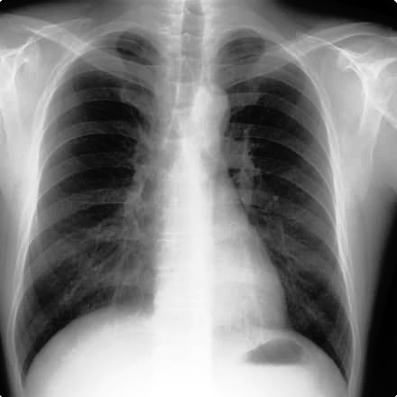
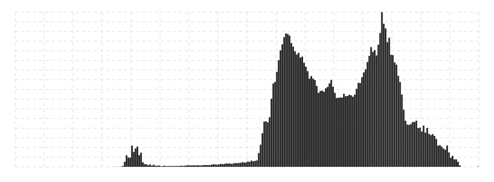
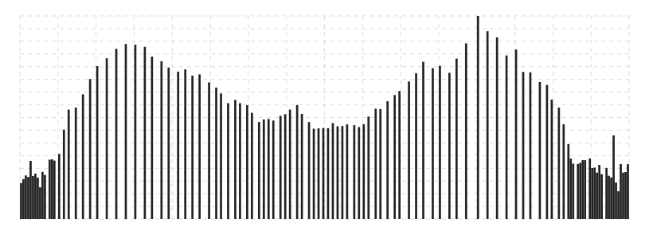

# GrayImageData

A classe [GrayImageData](../../source/GrayImageData.mjs) realiza operações somente com um canal em tons de cinza.

## Índice

**Métodos básicos**
- [clone](#clone)
- [fill](#fill)
- [crop](#crop)
- [resize](#resize)
- [getLine](#getLine)
- [setLine](#setLine)
- [getImageData](#getImageData)
- [toString](#toString)

**Pre-processamento**
- [brightness](#brightness)
- [contrast](#contrast)
- [negative](#negative)
- [threshold](#threshold)
- [thresholdMean](#thresholdMean)

**Mesclagem de imagens**
- [blend](#blend)
- [blendMax](#blendMax)
- [blendMin](#blendMin)

**Detecção de bordas**
- [conv](#conv)

**Equalização**
- [clahe](#clahe)
- [getHistogram](#getHistogram)

**Morfologia**
- [erode](#erode)
- [dilate](#dilate)
- [open](#open)
- [close](#close)


## Constructor

Seguindo o padrão do [ImageData](https://developer.mozilla.org/en-US/docs/Web/API/ImageData/ImageData), o [GrayImageData]() pode ser inciado dos seguintes modos

``` javascript

new GrayImageData(width, height)

new GrayImageData(dataArray, width)
new GrayImageData(dataArray, width, height)

```

Sendo `width` e `height` do tipo [Number](https://developer.mozilla.org/en-US/docs/Web/JavaScript/Reference/Global_Objects/Number),
e `dataArray` do tipo [Uint8ClampedArray](https://developer.mozilla.org/en-US/docs/Web/JavaScript/Reference/Global_Objects/Uint8ClampedArray).

### Propriedades de instâcia

| Propriedade | Tipo | Descrição |
|-------------|------|-----------|
| width       | [Number](https://developer.mozilla.org/en-US/docs/Web/JavaScript/Reference/Global_Objects/Number) | Um valor inteiro indicando a quantidade de colunas da imagem. |
| height      | [Number](https://developer.mozilla.org/en-US/docs/Web/JavaScript/Reference/Global_Objects/Number) | Um valor inteiro indicando a quantidade de linhas da imagem. |
| data        | [Uint8ClampedArray](https://developer.mozilla.org/en-US/docs/Web/JavaScript/Reference/Global_Objects/Uint8ClampedArray) | Os valores de cada um dos pixeis da imagem. |

> [!NOTE]
> `data` é um [Uint8ClampedArray](https://developer.mozilla.org/en-US/docs/Web/JavaScript/Reference/Global_Objects/Uint8ClampedArray) pois os valores resultante das operações deverão estar entre `0` e `255`.

## Métodos estáticos

### From

Inicia [GrayImageData]() a partir de um [ImageData](https://developer.mozilla.org/en-US/docs/Web/API/ImageData).

| Argumento | Tipo | Descrição |
|-----------|------|-----------|
| input     | [ImageData](https://developer.mozilla.org/en-US/docs/Web/API/ImageData) | Imagem original |
| options   | [Object](https://developer.mozilla.org/en-US/docs/Web/JavaScript/Reference/Global_Objects/Object) | Opções para iniciar o [GrayImageData]() |

> [!NOTE]
> Em `options` podem ser especificado um recorte (*crop*) e/ou um redimensionamento (*scale*) da imagem original.<br>
> *crop* deverá ser um [Array](https://developer.mozilla.org/en-US/docs/Web/JavaScript/Reference/Global_Objects/Array) de 4 inteiros, os dois primeiros indicam a posição do recorte e os dois ultimos indicam as dimensões.<br>
> *scale* deverá ser um [Array](https://developer.mozilla.org/en-US/docs/Web/JavaScript/Reference/Global_Objects/Array) de 2 flutuantes, indicando a scala nos eixos x e y.

No exemplo a seguir, o [GrayImageData]() é iniciado recortando (*crop*) um quadrado 100x100 pixels (deslocado 50 pixels da esquerda e do topo) é ampliado (*scale*) em 200%.

```javascript

DIP.Load('path/to/image', function( imagedata, context ) {
	
	let options = {
		crop: [ 50, 50, 100, 100 ],
		scale: [ 2, 2 ]
	};
	
	let graySource = DIP.GrayImageData.From( imagedata, options );
	
	DIP.CreateContext( graySource.getImageData(), document.body );
	
});

```

## Métodos de instâcia

### blend

Realiza a mesclagem de dois [GrayImageData]().

| Argumento | Tipo | Descrição |
|-----------|------|-----------|
| input     | [GrayImageData]() | Segunda Imagem para a mesclagem |
| as        | [Number](https://developer.mozilla.org/en-US/docs/Web/JavaScript/Reference/Global_Objects/Number) | Brilho da primeira imagem (instância referenciada). Valor entre `0.0 < x 1.0`. |
| bs        | [Number](https://developer.mozilla.org/en-US/docs/Web/JavaScript/Reference/Global_Objects/Number) | Brilho da segunda imagem (parametro `input`). Valor entre `0.0 < x 1.0`. |

#### Retorno

Uma nova [GrayImageData]() com a menor dimensão entre as duas imagens informadas.

#### Exemplo

Seja, `imageA` e `imageB` instâncias de [GrayImageData](). É gerado uma nova imagem (`imageC`) da mesclagem entre `imageA` e `imageB`.

```javascript

let imageC = imageA.blend( imageB, .5, .5 );

DIP.CreateContext( imageC, document.body );

```

----

### blendMin

Realiza a mesclagem dos menores valores entre dois [GrayImageData]().

| Argumento | Tipo | Descrição |
|-----------|------|-----------|
| input     | [GrayImageData]() | Segunda Imagem para a mesclagem |

#### Retorno

Uma nova [GrayImageData]() com a menor dimensão entre as duas imagens informadas.

----

### blendMax

Realiza a mesclagem dos maiores valores entre dois [GrayImageData]().

| Argumento | Tipo | Descrição |
|-----------|------|-----------|
| input     | [GrayImageData]() | Segunda Imagem para a mesclagem |

#### Retorno

Uma nova [GrayImageData]() com a menor dimensão entre as duas imagens informadas.

----

### brightness

Ajuste global da intensidade dos pixels, é realizado multiplicando os valores de intensidade.

| Argumento | Tipo | Descrição |
|-----------|------|-----------|
| s         | [Number](https://developer.mozilla.org/en-US/docs/Web/JavaScript/Reference/Global_Objects/Number) | Valor que irá multiplicar o valor de cada pixel. |

#### Retorno

O retorno é a própria instâcia ([GrayImageData]()), ou seja, os valores da *instância são alterados*.
Desse modo é possivel realizar o encadeamento de métodos.

----

### clahe

CLAHE (Contrast Limited Adaptive Histogram Equalization) é uma técnica de processamento de imagem usada para melhorar o contraste local em uma imagem.
Ela é uma extensão do método de equalização de histograma, que redistribui os valores de intensidade dos pixels em uma imagem para melhorar o contraste global. 

```javascript

DIP.Load( "path/to/image", function( imagedata ) {
	
	imagedata.clahe();
	
	DIP.CreateContext( imagedata, document.body );
	
});

```

| Antes  | Depois |
|:-:|:-:|
|  |  |
|  |  |

----

### clone

Cria uma nova instâcia de [GrayImageData]() com as mesmas dimensões e valores.

#### Retorno

Uma nova [GrayImageData]().

#### Exemplo

```javascript

DIP.Load( "path/to/image", function( imagedata ) {
	
	let copied = imagedata.clone();
	
});

```

----

### close

O [Fechamento](https://en.wikipedia.org/wiki/Closing_(morphology)) é uma operação de morfologia, da qual realiza a [dilatação](#dilate) seguida de [erosão](#erode).

Pode ser utilizada para preencher pequenos buracos e conectar regiões próximas, **fechando** espaços dentro de objetos e suavizando contornos.

| Argumento | Tipo | Descrição |
|-----------|------|-----------|
| matrix    | [Matrix](Matrix.md) | Uma matriz que define a estrutura da operação (Quadrado, Cruz, Círculo) |

#### Retorno

O retorno é a própria instâcia ([GrayImageData]()), ou seja, os valores da *instância são alterados*.
Desse modo é possivel realizar o encadeamento de métodos.

----

### contrast

Realiza o contraste da [GrayImageData]().

| Argumento | Tipo | Descrição |
|-----------|------|-----------|
| value     | [Number](https://developer.mozilla.org/en-US/docs/Web/JavaScript/Reference/Global_Objects/Number) | Valor que ajusta o contraste da imagem |

#### Retorno

O retorno é a própria instâcia ([GrayImageData]()), ou seja, os valores da *instância são alterados*.
Desse modo é possivel realizar o encadeamento de métodos.

----

### conv

O metodo `conv` realiza a [convolução](https://en.wikipedia.org/wiki/Kernel_\(image_processing\)) em uma imagem.

| Argumento | Tipo | Descrição |
|-----------|------|-----------|
| matrix    | Matrix | A matriz de convolução (tambem chamadas de Kernel ou Mask). Dependendo de seus valores poderá resultados com diferentes efeitos. |

#### Retorno

O retorno é a própria instâcia ([GrayImageData]()), ou seja, os valores da *instância são alterados*.
Desse modo é possivel realizar o encadeamento de métodos.

----

### crop

Realiza o recorte da [GrayImageData]().

| Argumento | Tipo | Descrição |
|-----------|------|-----------|
| rx        | [Number](https://developer.mozilla.org/en-US/docs/Web/JavaScript/Reference/Global_Objects/Number) | Posição `X` do inicio do recorte |
| ry        | [Number](https://developer.mozilla.org/en-US/docs/Web/JavaScript/Reference/Global_Objects/Number) | Posição `Y` do inicio do recorte |
| rw        | [Number](https://developer.mozilla.org/en-US/docs/Web/JavaScript/Reference/Global_Objects/Number) | Largura do recorte |
| rh        | [Number](https://developer.mozilla.org/en-US/docs/Web/JavaScript/Reference/Global_Objects/Number) | Altura do recorte |

#### Retorno

O retorno é uma nova instâcia de ([GrayImageData]()) com as dimensões `rw`x`rh`.

#### Exemplo

Seja `imageA` uma instância de [GrayImageData]().

```javascript

let imageB = imageA.blend( 0, 0, 50, 50 );

DIP.CreateContext( imageB, document.body );

```

----

### dilate

A [dilatação](https://en.wikipedia.org/wiki/Dilation_(morphology)) é uma operação em morfologia, da qual expande regiões claras, tornando os objetos maiores.

| Argumento | Tipo | Descrição |
|-----------|------|-----------|
| matrix    | [Matrix](Matrix.md) | Uma matriz que define a estrutura da operação (Quadrado, Cruz, Círculo) |

#### Retorno

O retorno é a própria instâcia ([GrayImageData]()), ou seja, os valores da *instância são alterados*.
Desse modo é possivel realizar o encadeamento de métodos.

----

### erode

A [erosão](https://en.wikipedia.org/wiki/Erosion_(morphology)) é uma operação em morfologia, da qual reduz as regiões claras, tornando os objetos menores.

| Argumento | Tipo | Descrição |
|-----------|------|-----------|
| matrix    | [Matrix](Matrix.md) | Uma matriz que define a estrutura da operação (Quadrado, Cruz, Círculo) |

#### Retorno

O retorno é a própria instâcia ([GrayImageData]()), ou seja, os valores da *instância são alterados*.
Desse modo é possivel realizar o encadeamento de métodos.

----

### fill

Preenche todos os pixeis da imgem com o mesmo valor.

| Argumento | Tipo | Descrição |
|-----------|------|-----------|
| bytes     | [Number](https://developer.mozilla.org/en-US/docs/Web/JavaScript/Reference/Global_Objects/Number) | Valor da intencidade do pixel (8 bits). |

#### Retorno

O retorno é a própria instâcia ([GrayImageData]()), ou seja, os valores da *instância são alterados*.
Desse modo é possivel realizar o encadeamento de métodos.

----

### getHistogram

Os argumentos são opcional, caso n

| Argumento | Tipo | Descrição |
|-----------|------|-----------|
| wx        | [Number](https://developer.mozilla.org/en-US/docs/Web/JavaScript/Reference/Global_Objects/Number) | Posição `X` do inicio do recorte.\nPadrão é `0` |
| wy        | [Number](https://developer.mozilla.org/en-US/docs/Web/JavaScript/Reference/Global_Objects/Number) | Posição `Y` do inicio do recorte.\nPadrão é `0` |
| ww        | [Number](https://developer.mozilla.org/en-US/docs/Web/JavaScript/Reference/Global_Objects/Number) | Largura do recorte.\nPadrão é a *largura* da imagem. |
| wh        | [Number](https://developer.mozilla.org/en-US/docs/Web/JavaScript/Reference/Global_Objects/Number) | Altura do recorte.\nPadrão é *altura* da imagem. |

#### Retorno

O retorno é um [Array](https://developer.mozilla.org/en-US/docs/Web/JavaScript/Reference/Global_Objects/Array) com 3 itens, um para cada canal da imagem (RGB).
Cada item é um [Object](https://developer.mozilla.org/en-US/docs/Web/JavaScript/Reference/Global_Objects/Object), em que `key` é a intensidade do pixel e `value` é a contagem (ocorrência) dessa intensidade.
**Obs**. Pode ser que algumas intensidades não existam no canal, e nesse caso não são contabilizados.

#### Exemplo

Seja `source` uma instância de [GrayImageData]().

```javascript

let histogramData = source.getHistogram();

let redChannel = histogramData[0];
let greenChannel = histogramData[1];
let blueChannel = histogramData[2];

```

----

### getLine

Realiza a leitura dos pixeis do ponto `ax,ay` ao `bx,by`.

| Argumento | Tipo | Descrição |
|-----------|------|-----------|
| ax        | [Number](https://developer.mozilla.org/en-US/docs/Web/JavaScript/Reference/Global_Objects/Number) | Posição `X` do inicio da linha |
| ay        | [Number](https://developer.mozilla.org/en-US/docs/Web/JavaScript/Reference/Global_Objects/Number) | Posição `Y` do inicio da linha |
| bx        | [Number](https://developer.mozilla.org/en-US/docs/Web/JavaScript/Reference/Global_Objects/Number) | Posição `X` do final da linha |
| by        | [Number](https://developer.mozilla.org/en-US/docs/Web/JavaScript/Reference/Global_Objects/Number) | Posição `Y` do final da linha |

#### Retorno

O retorno é um [Uint32Array](https://developer.mozilla.org/en-US/docs/Web/JavaScript/Reference/Global_Objects/Uint32Array), em que cada item é a cor de um pixel (32 bits).

----

### getImageData

Como [GrayImageData]() possui somente um canal, é necessário converter em [ImageData](https://developer.mozilla.org/en-US/docs/Web/API/ImageData) para ser renderizado.

#### Retorno

O retorno é um [ImageData](https://developer.mozilla.org/en-US/docs/Web/API/ImageData).

----

### negative

Inverte os valores de RGB.

#### Retorno

O retorno é a própria instâcia ([GrayImageData]()), ou seja, os valores da *instância são alterados*.
Desse modo é possivel realizar o encadeamento de métodos.

----

### open

A [abertura](https://en.wikipedia.org/wiki/Opening_(morphology)) é uma operação de morfologia, da qual realiza a [erosão](#erode) seguida de [dilatação](#dilate).

Pode ser utilizada usada para remover ruídos e suavizar contornos sem afetar significativamente o tamanho dos objetos principais.

| Argumento | Tipo | Descrição |
|-----------|------|-----------|
| matrix    | [Matrix](Matrix.md) | Uma matriz que define a estrutura da operação (Quadrado, Cruz, Círculo) |

#### Retorno

O retorno é a própria instâcia ([GrayImageData]()), ou seja, os valores da *instância são alterados*.
Desse modo é possivel realizar o encadeamento de métodos.

----

### resize

Redimensiona a [GrayImageData]().

| Argumento | Tipo | Descrição |
|-----------|------|-----------|
| sx        | [Number](https://developer.mozilla.org/en-US/docs/Web/JavaScript/Reference/Global_Objects/Number) | Valor que ira multiplicar no eixo `X`. Padrão é `1`. |
| sy        | [Number](https://developer.mozilla.org/en-US/docs/Web/JavaScript/Reference/Global_Objects/Number) | Valor que ira multiplicar no eixo `Y`. Padrão é `1`. |

#### Retorno

O retorno é uma nova instâcia de ([GrayImageData]()) com as dimensões multiplicadas (`sx*width, sy*height`).

----

### setLine

Define o valor dos pixeis do ponto `ax,ay` ao `bx,by`. Note que o parâmetro `bytes` pode ser 
- [Number](https://developer.mozilla.org/en-US/docs/Web/JavaScript/Reference/Global_Objects/Number): A linha toda será preenchida com o mesmo valor; ou
- [Uint32Array](https://developer.mozilla.org/en-US/docs/Web/JavaScript/Reference/Global_Objects/Uint32Array): A linha será preenchida com os valores da sequência informada.

| Argumento | Tipo | Descrição |
|-----------|------|-----------|
| ax        | [Number](https://developer.mozilla.org/en-US/docs/Web/JavaScript/Reference/Global_Objects/Number) | Posição `X` do inicio da linha |
| ay        | [Number](https://developer.mozilla.org/en-US/docs/Web/JavaScript/Reference/Global_Objects/Number) | Posição `Y` do inicio da linha |
| bx        | [Number](https://developer.mozilla.org/en-US/docs/Web/JavaScript/Reference/Global_Objects/Number) | Posição `X` do final da linha |
| by        | [Number](https://developer.mozilla.org/en-US/docs/Web/JavaScript/Reference/Global_Objects/Number) | Posição `Y` do final da linha |
| bytes     | [Number](https://developer.mozilla.org/en-US/docs/Web/JavaScript/Reference/Global_Objects/Number) \| [Uint32Array](https://developer.mozilla.org/en-US/docs/Web/JavaScript/Reference/Global_Objects/Uint32Array) | Valores em que cada pixel que será preenchido na linha. **Recomendação:** Utilizar o método `getBytes()` de uma instância de [Color](Color.md#getBytes). |

#### Retorno

O retorno é a própria instâcia ([RGBAImageData]()), ou seja, os valores da *instância são alterados*.
Desse modo é possivel realizar o encadeamento de métodos.

----

### threshold

Torna a imagem em preto e branco. Note que a imagem ainda possui os 4 canais (RGBA), porém os canais RGB possuem o mesmo valor.

| Argumento | Tipo | Descrição |
|-----------|------|-----------|
| value     | [Number](https://developer.mozilla.org/en-US/docs/Web/JavaScript/Reference/Global_Objects/Number) | Valor de referencia para a binarização. |
| min       | [Number](https://developer.mozilla.org/en-US/docs/Web/JavaScript/Reference/Global_Objects/Number) | Valor alternativo para quando o pixel estiver abaixo do limite. Padrão é `0` |
| max       | [Number](https://developer.mozilla.org/en-US/docs/Web/JavaScript/Reference/Global_Objects/Number) | Valor alternativo para quando o pixel estiver acima do limite. Padrão é `255` |

#### Retorno

O retorno é a própria instâcia ([GrayImageData]()), ou seja, os valores da *instância são alterados*.
Desse modo é possivel realizar o encadeamento de métodos.

----

### thresholdMean

Torna a imagem em preto e branco, em que o `threshold` é o valor medio das intencidades. Note que a imagem ainda possui os 4 canais (RGBA), porém os canais RGB possuem o mesmo valor.

| Argumento | Tipo | Descrição |
|-----------|------|-----------|
| stepper   | [Number](https://developer.mozilla.org/en-US/docs/Web/JavaScript/Reference/Global_Objects/Number) | Define os intervalos dos pixeis lidos, para otimizr o cálculo do do limite. Padrão é `5`. |
| min       | [Number](https://developer.mozilla.org/en-US/docs/Web/JavaScript/Reference/Global_Objects/Number) | Valor alternativo para quando o pixel estiver abaixo do limite. Padrão é `0`. |
| max       | [Number](https://developer.mozilla.org/en-US/docs/Web/JavaScript/Reference/Global_Objects/Number) | Valor alternativo para quando o pixel estiver acima do limite. Padrão é `255`. |

#### Retorno

O retorno é a própria instâcia ([GrayImageData]()), ou seja, os valores da *instância são alterados*.
Desse modo é possivel realizar o encadeamento de métodos.

----

### toString

É possivel transformar a imagem em texto, de forma que os caracteres imitem um gradiente de tons de cinza.

#### Retorno

O retorno é uma [String](https://developer.mozilla.org/en-US/docs/Web/JavaScript/Reference/Global_Objects/String).

#### Example

```javascript

let grayScaleChars = "$%#kw0Xvr/1?+:~.";

let asciiArt = source.toString( grayScaleChars );

console.log( asciiArt )

```

<pre style="font-size:8px">
..................................................................................
..................................................................................
..................................................................................
......................%%%................................%%0......................
......................%%%%%0..........................%%%%%%......................
.....................0%%%%%%%%......................%%%%%%%%......................
.....................%%%%%%%%%%?...%%%%%%%%%%%%%..%%%%%%%%%%......................
.....................%%%%%%%%%%%%%%%%%%%%%%%%%%%%%%%%%%%%%%%......................
.....................%%%%%%%%%%%%%%%%%%%%%%%%%%%%%%%%%%%%%%%0.....................
.....................%%%%%%%%%%%%%%%%%%%%%%%%%%%%%%%%%%%%%%%0.....................
.....................%%%%%%%%%%%%%%%%%%%%%%%%%%%%%%%%%%%%%%%......................
.....................%%%%%%%%%%%%%%%%%%%%%%%%%%%%%%%%%%%%%%%......................
......................%%%%%%%%%%%%%%%%%%%%%%%%%%%%%%%%%%%%%%......................
.....................%%%%%%%%%%%%%%%%%%%%%%%%%%%%%%%%%%%%%%%%.....................
.....................%%%%%%%%%%%%%%%%%%%%%%%%%%%%%%%%%%%%%%%%%....................
....................%%%%%%%%%%%%%%%%%%%%%%%%%%%%%%%%%%%%%%%%%%1...................
...................?%%%%%%%%%%%%%%%%%%%%%%%%%%%%%%%%%%%%%%%%%%%...................
...................%%%%%%%%%%%%%%%%%%%%%%%%%%%%%%%%%%%%%%%%%%%%...................
...................%%%%%%%%%%%%%%%%%%%%%%%%%%%%%%%%%%%%%%%%%%%%%..................
..................%%%%%%%%%%%%%%%%%%%%%%%%%%%%%%%%%%%%%%%%%%%%%%..................
..................%%%%%%%%%%%%%%%%%%%%%%%%%%%%%%%%%%%%%%%%%%%%%%..................
..................%%%%%%%%%%%1111111111111111111111111%%%%%%%%%%..................
..................%%%%%%%%%1:::::::::::::::::::::::::::1%%%%%%%%..................
..................%%%%%%%%1:::::::::::::::::::::::::::::1%%%%%%%..................
..................%%%%%%%1::::....::::::::::::::::...::::%%%%%%%..................
..................%%%%%%%::::......::::::::::::::.....::::%%%%%%..................
..................%%%%%%1::::..vvv.:::::::::::::..vv?.::::%%%%%%..................
..................%%%%%%:::::.v.vv.:::::::::::::.v.vv..::::%%%%%..................
..................1%%%%%::::..vvvvv.::::::::::::.vvvv..::::%%%%%..................
...................%%%%%::::..vvvvv.::::::::::::.vvvv..::::%%%%%..................
...................%%%%%:::::.vvvvv:::::::::::::.vvvv..::::%%%%0..................
......0%%?.........0%%%%:::::.vvvv.:::::::::::::.vvvv..::::%%%%..........?%%0.....
....................%%%%0::::..1v..:::::::::::::..vv..::::%%%%%...................
..........%%........0%%%%:::::....:::::::v:::::::....:::::%%%%?........%%?........
.....00..............%%%%0:::::::::::::::v:::::::::.:::::0%%%%..............1%....
......................%%%%:::::::::::::::::::::::::::::::%%%%.....................
.......................%%%%::::::::::::1::1:::::::::::::%%%%......................
........................%%%%%::::::::::::v:::::::::::::%%%%.......................
..........................%%%%%%::::::::::::::::::::%%%%%1........................
.................%1.........0%%%%%%%%%%%%%%%%%%%%%%%%%%...........................
................%%%+%..........?%%%%%%%%%%%%%%%%%%%%..............................
..................%%+%.............%%%%%%%%%%%%%..................................
...................%%%%...........%%%%%%%%%%%%%%%?................................
................++..%%+..........%%%%%%%%%%%%%%%%%................................
.....................%%+.........%%%%%%%%%%%%%%%%%................................
.....................%%%%?......%%%%%%%%%.%%%%%%%%%...............................
......................%%%+%%%%%1%%%%%%%%%.%%%%%%%%%...............................
.......................%%%%1%+%%%%%%.%%%%.%%%%.%%%%...............................
........................%%%%%%%%%%%%.%%%%.%%%%.%%%%...............................
.........................1%%%%%%%%%%.%%%%.%%%%.%%%%...............................
................................%%%%.%%%%.%%%%.%%%%...............................
................................%%%%.%%%%.%%%%.%%%%...............................
................................%%%%.%%%%.%%%%.%%%%...............................
................................%%%%.%%%%.%%%%.%%%%...............................
................................%%%%.%%%%+%%%%+%%%%...............................
...............................+%%%%+%%%%+%%%%+%%%%++.............................
...........................+++++%%%%+%%%%+%%%%+%%%%++++++.........................
........................++++++++%%%%+%%%%+%%%%+%%%%+++++++++......................
.......................+++++++++%%%%+%%%%+%%%%+%%%%++++++++++.....................
.....................++++++++++%%%%++%%%%+%%%%++%%%%++++++++++....................
....................+++++++++0%%%%1++%%%%+%%%%+++%%%%%+++++++++...................
....................+++++++++1%%11+++%%%%+%%%%+++11%%1++++++++++..................
....................+++++++++++1111+%%%%+++%%%%+1111++++++++++++..................
.....................+++++++++++111%%%%1+++1%%%%111++++++++++++...................
.....................+++++++++++1111+1111++11111111++++++++++++...................
.......................+++++++++1111+1111+1111+1111++++++++++.....................
........................++++++++1111+1111+1111+1111++++++++.......................
...........................+++++1111+1111+1111+1111+++++1.........................
..............................++1111+1111+1111+1111++.............................
......................................+11+111+....................................
..................................................................................
</pre>

